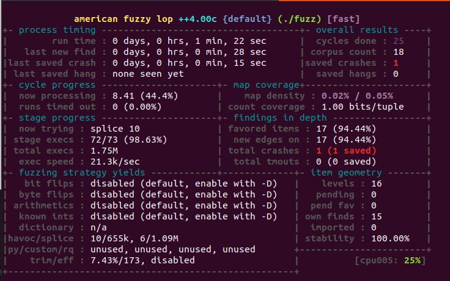
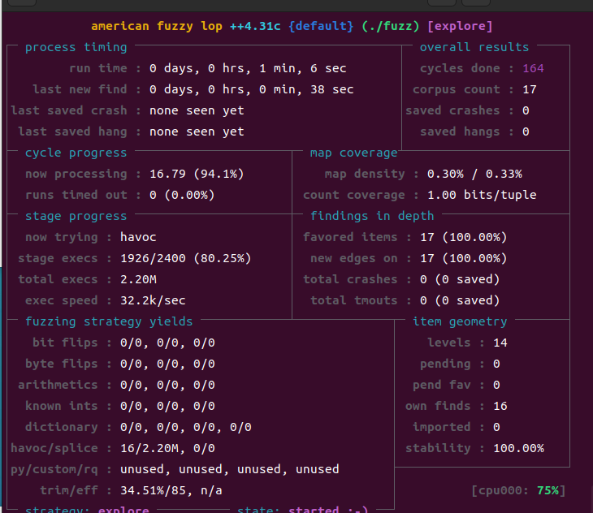
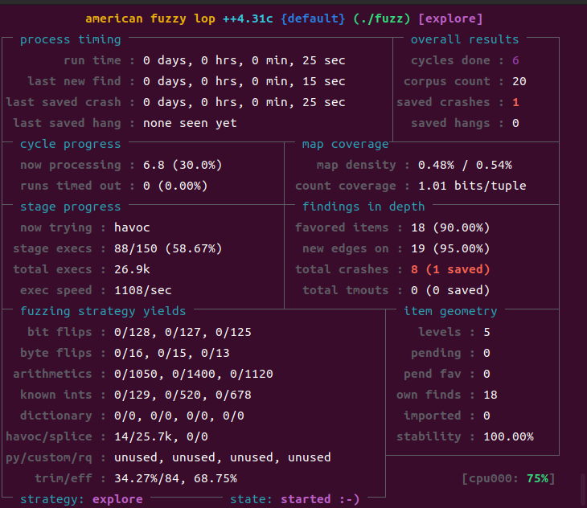
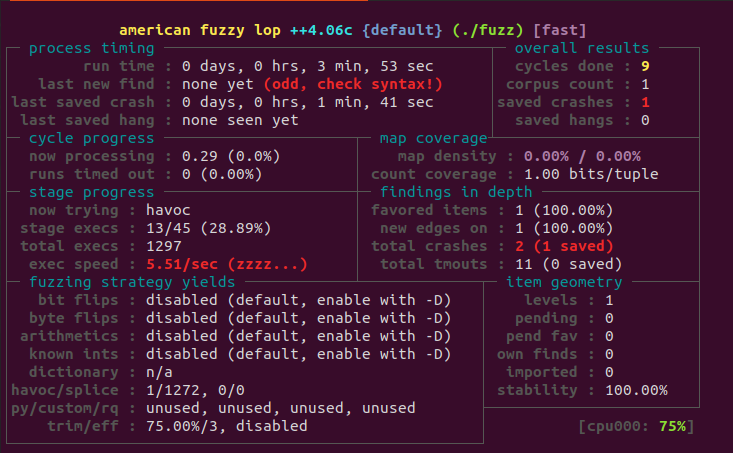
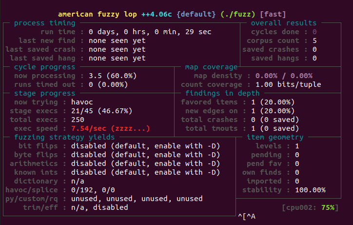

# AFLpp-Android-Greybox项目


# 一、下载相关项目

## 1.1 下载相关依赖

```bash
#　依赖
apt update
apt install cmake curl unzip xxd git
```


## 1.2 下载相关项目

```bash
#　下载aflplusplus项目
curl https://codeload.github.com/AFLplusplus/AFLplusplus/zip/refs/tags/4.06c --output 4.06c.zip
unzip 4.06c.zip

# 下载ndk
curl https://dl.google.com/android/repository/android-ndk-r25c-linux.zip --output ndk.zip
unzip ndk.zip

# 将cmakelist移动到afl++中
# 如果是x86_64架构
cp CMakeLists_x86_64.txt AFLplusplus-4.06c/CMakeLists.txt
# 如果是x86架构
cp CMakeLists_x86.txt AFLplusplus-4.06c/CMakeLists.txt
# 如果是arm32架构
cp CMakeLists_arm.txt AFLplusplus-4.06c/CMakeLists.txt
# 如果是arm64架构
cp CMakeLists_arm64.txt AFLplusplus-4.06c/CMakeLists.txt
```


## 1.3 构建

```bash
cd AFLplusplus-4.06c/
mkdir build
cd build

# 注意，android-ndk-r25c的地址
# 如果是arm64架构
cmake -DANDROID_PLATFORM=26 -DCMAKE_TOOLCHAIN_FILE=../../android-ndk-r25c/build/cmake/android.toolchain.cmake -DANDROID_ABI=arm64-v8a ..
# 如果是arm架构
cmake -DANDROID_PLATFORM=26 -DCMAKE_TOOLCHAIN_FILE=../../android-ndk-r25c/build/cmake/android.toolchain.cmake -DANDROID_ABI=armeabi-v7a ..
# 如果是x86_64架构
cmake -DANDROID_PLATFORM=26 -DCMAKE_TOOLCHAIN_FILE=../../android-ndk-r25c/build/cmake/android.toolchain.cmake -DANDROID_ABI=x86_64 ..
# 如果是x86架构
cmake -DANDROID_PLATFORM=26 -DCMAKE_TOOLCHAIN_FILE=../../android-ndk-r25c/build/cmake/android.toolchain.cmake -DANDROID_ABI=x86 ..

# 然后构建
make
```


## 1.4 复制到设备

```bash
# 将afl-fuzz和afl-frida-trace.so文件复制到android设备中
adb push afl-fuzz afl-frida-trace.so /data/local/tmp
```


# 二、测试

## 2.1 C/C++项目

```bash
# 下载被测目标
git clone https://github.com/fuzzstati0n/fuzzgoat.git

cd fuzzgoat/

#修改Makfile文件的第一行
CC=../android-ndk-r25c/toolchains/llvm/prebuilt/linux-x86_64/bin/x86_64-linux-android26-clang

# 然后make
make

adb push fuzzgoat fuzzgoat_ASAN in /data/local/tmp
```


### 2.1.1 黑盒模糊测试

运行命令如下：

```bash
adb shell
cd /data/local/tmp/
# 执行黑盒
./afl-fuzz -i in -o out -n -- ./fuzzgoat @@
```


注意：如果ctrl+c啥的退不出当前终端，可以考虑新开一个终端，然后输入killall -9 afl-fuzz来杀死当前进程。

```
killall -9 afl-fuzz
```


### 2.1.2 灰盒模糊测试

运行命令如下：

```bash
adb shell
cd /data/local/tmp/

# 先测试
LD_PRELOAD=./afl-frida-trace.so ./fuzzgoat ./in/seed

# 注意：如果测试出现问题，一般都是afl.js文件的问题，将其删除或者进行合理化的修改

#　执行灰盒
./afl-fuzz -i in -o out -O -- ./fuzzgoat @@
```


## 2.2 Android项目

test_demo是Android项目，生成的apk文件默认位于项目目录下的app/build/outputs/apk/文件夹中

这个具体为

```
这个具体为test_demo/app/build/outputs/apk/debug/app-debug.apk
```


运行Android设备

```bash
cd android/
# 1. 移动被测apk
adb push app-debug.apk /data/local/tmp/target-app.apk

# 2. 移动so库
unzip -d ./app-debug-zip app-debug.apk

# x86_64架构
adb push ./app-debug-zip/lib/x86_64/* /data/local/tmp
# arm架构
adb push ./app-debug-zip/lib/arm64-v8a/* /data/local/tmp

# 3. 构建驱动程序,并移动到设备中

# x86_64架构
../android-ndk-r25c/toolchains/llvm/prebuilt/linux-x86_64/bin/x86_64-linux-android26-clang -o server server.c lib/vm.c -I lib -L lib -Wall -O3 -ldl -Wl,--export-dynamic
# arm架构
../android-ndk-r25c/toolchains/llvm/prebuilt/linux-x86_64/bin/aarch64-linux-android26-clang -o server server.c lib/vm.c -I lib -L lib -Wall -O3 -ldl -Wl,--export-dynamic

adb push server /data/local/tmp/

# 4. 测试
adb shell
cd /data/local/tmp/
./server in/seed1
```

运行结果如下：


### 2.2.1 黑盒模糊测试

```bash
adb shell
cd /data/local/tmp
./afl-fuzz -i in -o out -t 10000+ -m none -n -- ./server @@
```


### 2.2.2 灰盒模糊测试

```bash
adb shell
cd /data/local/tmp
./afl-fuzz -i in -o out -t 10000+ -m none -O -- ./server @@

# 如果确保./server在执行种子时不会导致崩溃，那么灰盒模糊测试失败的原因就在于server中使用了dlopen函数
```

实际上，这个灰盒模糊测试还在测试中。等待修复成功。


# 三、android fuzzing arm

## 3.1 jenv

按照章节一进行arm64架构配置

```bash
cd jenv
mkdir build && cd build
# toollcain_file的地址需要精准
cmake -DANDROID_PLATFORM=26 -DCMAKE_TOOLCHAIN_FILE=../../android-ndk-r25c/build/cmake/android.toolchain.cmake -DANDROID_ABI=arm64-v8a ..
make

adb push libjenv.so /data/local/tmp
```

生成arm64架构的libjenv.so文件


## 3.2 native

```bash
cd native
cp ../apk/qb.blogfuzz/lib/arm64-v8a/libblogfuzz.so ./lib/

mkdir build && cd build

# toollcain_file的地址需要精准
cmake -DANDROID_PLATFORM=26 -DCMAKE_TOOLCHAIN_FILE=../../android-ndk-r25c/build/cmake/android.toolchain.cmake -DANDROID_ABI=arm64-v8a ..

make

adb push fuzz /data/local/tmp
adb push ../lib/libblogfuzz.so /data/local/tmp
# 不考虑afl.js文件
# adb push ../afl.js /data/local/tmp

# 验证
adb shell
cd /data/local/tmp
rm -rf in out
mkdir in
dd if=/dev/urandom of=in/sample.bin bs=1 count=16
./afl-fuzz -i in -o out -O -G　256 -- ./fuzz
```

运行截图：



验证:

```bash
adb shell
killall -9 afl-fuzz
cd /data/local/tmp
# 复现
LD_PRELOAD=./afl-frida-trace.so ./fuzz ./out/default/crashes/id***
```


## 3.3 slinked_jni 强链接

```bash
# 验证
adb shell
cd /data/local/tmp
./afl-fuzz -i in -o out -O -G　256 -- ./fuzzcd native
mkdir build && cd build
# toollcain_file的地址需要精准
cmake -DANDROID_PLATFORM=26 -DCMAKE_TOOLCHAIN_FILE=../../android-ndk-r25c/build/cmake/android.toolchain.cmake -DANDROID_ABI=arm64-v8a ..
make

adb push fuzz /data/local/tmp
adb push ../afl.js ../lib/libblogfuzz.so ../lib/libjenv.so /data/local/tmp

# 验证
adb shell
cd /data/local/tmp
./afl-fuzz -i in -o out -O -G　256 -- ./fuzz
```


## 3.4 wliked_jni 弱链接

```bash
cd native
mkdir build && cd build
# toollcain_file的地址需要精准 
cmake -DANDROID_PLATFORM=31 -DCMAKE_TOOLCHAIN_FILE=../../android-ndk-r25c/build/cmake/android.toolchain.cmake -DANDROID_ABI=x86_64 ..

make
adb push fuzz /data/local/tmp
adb push ../lib/libblogfuzz.so /data/local/tmp
# 不考虑afl.js文件
#　adb push ../afl.js /data/local/tmp

# 验证
adb shell
cd /data/local/tmp
./afl-fuzz -i in -o out -O -G　256 -- ./fuzz
```


# 四、Android fuzzing x86_64

## 4.1 jenv

按照章节一进行x86_64架构配置

```bash
cd jenv
rm -rf build && mkdir build && cd build
cmake -DANDROID_PLATFORM=26 -DCMAKE_TOOLCHAIN_FILE=../../android-ndk-r25c/build/cmake/android.toolchain.cmake -DANDROID_ABI=x86_64 ..
make

adb push libjenv.so /data/local/tmp
```

生成x86_64架构的libjenv.so文件


注意：如果是x86架构的话，jenv需要进行修改，因为在下面的Fuzz过程中，使用adb logcat查看命令时，会出现下面的问题

```
04-08 09:23:26.844  7006  7006 V jenv    : [+] Initialize Java environment
04-08 09:23:26.844  7006  7006 E jenv    : [!] undefined symbol: JniInvocationCreate
```

这意味着代码在x86架构中是存在问题的。


注意： 在虚拟机Pixel 6 API 31上面没有触发这个问题，正常运行。


## 4.2 native

```bash
cd native
cp ../apk/qb.blogfuzz/lib/x86_64/libblogfuzz.so ./lib/
rm -rf build && mkdir build && cd build

# toollcain_file的地址需要精准
cmake -DANDROID_PLATFORM=26 -DCMAKE_TOOLCHAIN_FILE=../../android-ndk-r25c/build/cmake/android.toolchain.cmake -DANDROID_ABI=x86_64 ..

make

adb push fuzz /data/local/tmp
adb push ../lib/libblogfuzz.so /data/local/tmp/
# 将4.1生成的libjenv.so复制到Android设备中
adb push ../../jenv/build/libjenv.so /data/local/tmp
# afl插桩文件
adb push ../afl_x86.js /data/local/tmp/afl.js

# 验证
adb shell
cd /data/local/tmp
mkdir in
dd if=/dev/urandom of=in/sample.bin bs=1 count=16
# 放一个漏洞进去
echo "Quarksl4bfuzzMe!" > in/crash

# 验证是否触发漏洞
# 方法1:
cat in/crash | ./fuzz
# 方法2:
./afl-fuzz -i in -o out -n -- ./fuzz


# 运行灰盒模糊测试
./afl-fuzz -i in -o out -O -G　256 -- ./fuzz

```

运行截图：

没有把crash放入时的截图：



如果把漏洞放进入或者跑出了漏洞，速度就极速下降了。从32.2k/sec -> 1108/sec



## 4.3 slinked_jni 强链接

```bash
# 步骤1: 移动相关信息到待编译库中
cd slinked_jni
cp ../apk/qb.blogfuzz/lib/x86_64/libblogfuzz.so ./lib/
cp ../jenv/build/libjenv.so ./lib/

# 步骤２: 编译并构建fuzz
mkdir build && cd build

# toollcain_file的地址需要精准
cmake -DANDROID_PLATFORM=26 -DCMAKE_TOOLCHAIN_FILE=../../android-ndk-r25c/build/cmake/android.toolchain.cmake -DANDROID_ABI=x86_64 ..

make

# 步骤３:移植
cd ../
# java版本1.8.0_301
javac Wrapper.java
# dm版本29.0.2
/home/test/Android/Sdk/build-tools/29.0.2/d8 Wrapper.class
mv classes.dex mock.dex


# 移植
cd build
adb push ../mock.dex /data/local/tmp
adb push fuzz /data/local/tmp
adb push ../lib/libblogfuzz.so ../lib/libjenv.so /data/local/tmp
adb push ../afl_x86.js /data/local/tmp/afl.js

# 验证
adb shell
cd /data/local/tmp
dd if=/dev/urandom of=in/sample.bin bs=1 count=16
./afl-fuzz -i in -o out -O -G　256 -- ./fuzz

# 如果报错，可以考虑下面的语句
AFL_NO_FORKSRV=1 ./afl-fuzz -i in -o out -O -G 256 -- ./fuzz

```

运行截图：




## 4.4 wlinked_jni 弱链接

```bash
cd wlinked_jni
cp ../apk/qb.blogfuzz/lib/x86_64/libblogfuzz.so ./lib/
cp ../jenv/build/libjenv.so ./lib/

mkdir build && cd build
cmake -DANDROID_PLATFORM=26 -DCMAKE_TOOLCHAIN_FILE=../../android-ndk-r25c/build/cmake/android.toolchain.cmake -DANDROID_ABI=x86_64 ..

make


adb push fuzz /data/local/tmp
adb push ../lib/libblogfuzz.so ../lib/libjenv.so /data/local/tmp
adb push ../afl_x86.js /data/local/tmp/afl.js

# 验证
adb shell
cd /data/local/tmp
AFL_DEBUG=1 AFL_NO_FORKSRV=1 ./afl-fuzz -i in -o out -O -G　256 -t 1000+ -- ./fuzz

# 如果运行不起来，则将afl.rs文件删除，重试
```

运行截图：




复现命令

```sh
adb shell
cd /data/local/tmp
cat in/1 | LD_PRELOAD=./afl-frida-trace.so ./fuzz
```


# 五、疑问

## 5.1

使用andorid-fuzzing时，如果不使用`AFL_NO_FORKSRV=1`的话，程序运行不起来，使用`AFL_DEBUG=1`，`AFL_DEBUG_CHILD=1`，`AFL_


AFL++ Frida持久模式的修复

```
参考文献：
https://github.com/AFLplusplus/AFLplusplus/commit/1369cf7176c552286eb8c12de70cf3bbdddc4981
```

相关参考

https://github.com/AFLplusplus/AFLplusplus/issues/2298

里面提及Afl.setInstrumentNoDynamicLoad()


## 5.2 

如果崩溃触发的太慢的话，可以考虑将崩溃种子作为输入。


## 5.3 Android各个版本测试

Android Fuzz支持情况

```shell
adb shell getprop ro.build.version.release
```


前提准备

```
cd /home/test/TCL/AFLpp-Android-Greybox/AFLplusplus-4.06c/build
adb push afl-frida-trace.so afl-fuzz /data/local/tmp/
```


表格如下：

| Android API      | x86_64                 | x86 | arm32 | arm64 |
| ---------------- | ---------------------- | --- | ----- | ----- |
| 22 Android 5.1   |                        |     |       |       |
| 23 Android 6.0   |                        |     |       |       |
| 24 Anroid  7.0   |                        |     |       |       |
| 25 Android 7.1.1 |                        |     |       |       |
| 26 Android 8.0   |                        |     |       |       |
| 27 Android 8.1   |                        |     |       |       |
| 28 Android 9.0   | AFL_NO_FORKSRV=1 Frida |     |       |       |
| 29 Android10.0   |                        |     |       |       |
| 30 Android 11.0  |                        |     |       |       |
| 31 Android 12.0  | Frida                  |     |       |       |
| 32 Android 12L   |                        |     |       |       |
| 33 Android 13.0  |                        |     |       |       |
| 34 Android 14    |                        |     |       |       |
| 35 Android 15    |                        |     |       |       |


```


```


