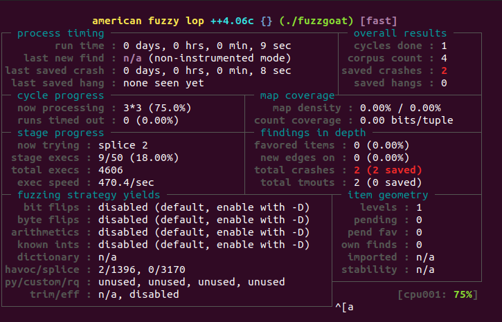
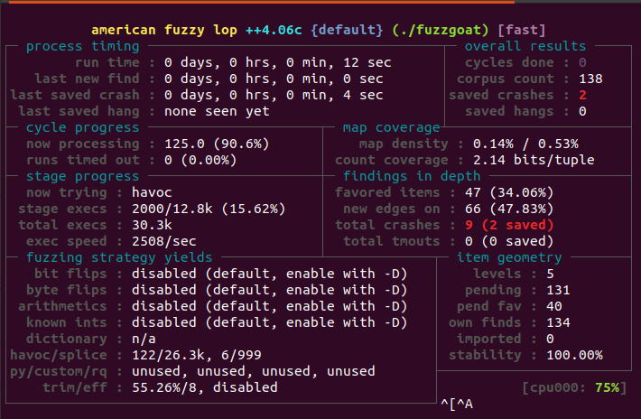
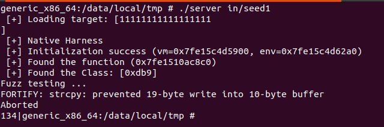
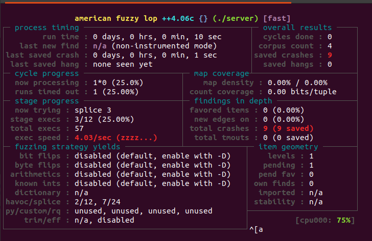

# AFLpp-Android-Greybox项目


# 一、下载相关项目

## 1.1 下载相关依赖

```bash
#　依赖
apt update
apt install cmake curl unzip xxd git
```


## 1.2 下载相关项目

```bash
#　下载aflplusplus项目
curl https://codeload.github.com/AFLplusplus/AFLplusplus/zip/refs/tags/4.06c --output 4.06c.zip
unzip 4.06c.zip

# 下载ndk
curl https://dl.google.com/android/repository/android-ndk-r25c-linux.zip --output ndk.zip
unzip ndk.zip

# 将cmakelist移动到afl++中
# 如果是x86_64架构
cp CMakeLists_x86.txt AFLplusplus-4.06c/CMakeLists.txt

# 如果是arm64架构
cp CMakeLists_arm.txt AFLplusplus-4.06c/CMakeLists.txt
```


## 1.3 构建

```bash
cd AFLplusplus-4.06c/
mkdir build
cd build

# 注意，android-ndk-r25c的地址
# 如果是arm架构
cmake -DANDROID_PLATFORM=26 -DCMAKE_TOOLCHAIN_FILE=../../android-ndk-r25c/build/cmake/android.toolchain.cmake -DANDROID_ABI=arm64-v8a ..
# 如果是x86_64架构
cmake -DANDROID_PLATFORM=26 -DCMAKE_TOOLCHAIN_FILE=../../android-ndk-r25c/build/cmake/android.toolchain.cmake -DANDROID_ABI=x86_64 ..

# 然后构建
build
```


## 1.4 复制到设备

```bash
# 将afl-fuzz和afl-frida-trace.so文件复制到android设备中
adb push afl-fuzz afl-frida-trace.so /data/local/tmp
```


# 二、测试

## 2.1 C/C++项目

```bash
# 下载被测目标
git clone https://github.com/fuzzstati0n/fuzzgoat.git

cd fuzzgoat/

#修改Makfile文件的第一行
CC=../android-ndk-r25c/toolchains/llvm/prebuilt/linux-x86_64/bin/x86_64-linux-android26-clang

# 然后make
make

adb push fuzzgoat fuzzgoat_ASAN in /data/local/tmp
```


### 2.1.1 黑盒模糊测试

运行命令如下：

```bash
adb shell
cd /data/local/tmp/
# 执行黑盒
./afl-fuzz -i in -o out -n -- ./fuzzgoat @@
```




注意：如果ctrl+c啥的退不出当前终端，可以考虑新开一个终端，然后输入killall -9 afl-fuzz来杀死当前进程。

```
killall -9 afl-fuzz
```


### 2.1.2 灰盒模糊测试

运行命令如下：

```bash
adb shell
cd /data/local/tmp/

# 先测试
LD_PRELOAD=./afl-frida-trace.so ./fuzzgoat ./in/seed

# 注意：如果测试出现问题，一般都是afl.js文件的问题，将其删除或者进行合理化的修改

#　执行灰盒
./afl-fuzz -i in -o out -O -- ./fuzzgoat @@
```




## 2.2 Android项目

test_demo是Android项目，生成的apk文件默认位于项目目录下的app/build/outputs/apk/文件夹中

这个具体为

```
这个具体为test_demo/app/build/outputs/apk/debug/app-debug.apk
```


运行Android设备

```bash
cd android/
# 1. 移动被测apk
adb push app-debug.apk /data/local/tmp/target-app.apk

# 2. 移动so库
unzip -d ./app-debug-zip app-debug.apk

# x86_64架构
adb push ./app-debug-zip/lib/x86_64/* /data/local/tmp
# arm架构
adb push ./app-debug-zip/lib/arm64-v8a/* /data/local/tmp

# 3. 构建驱动程序,并移动到设备中

# x86_64架构
../android-ndk-r25c/toolchains/llvm/prebuilt/linux-x86_64/bin/x86_64-linux-android26-clang -o server server.c lib/vm.c -I lib -L lib -Wall -O3 -ldl -Wl,--export-dynamic
# arm架构
../android-ndk-r25c/toolchains/llvm/prebuilt/linux-x86_64/bin/aarch64-linux-android26-clang -o server server.c lib/vm.c -I lib -L lib -Wall -O3 -ldl -Wl,--export-dynamic

adb push server /data/local/tmp/

# 4. 测试
adb shell
cd /data/local/tmp/
./server in/seed1
```

运行结果如下：




### 2.2.1 黑盒模糊测试

```bash
adb shell
cd /data/local/tmp
./afl-fuzz -i in -o out -t 10000+ -m none -n -- ./server @@
```




### 2.2.2 灰盒模糊测试

```bash
adb shell
cd /data/local/tmps
./afl-fuzz -i in -o out -t 10000+ -m none -O -- ./server @@

# 如果确保./server在执行种子时不会导致崩溃，那么灰盒模糊测试失败的原因就在于server中使用了dlopen函数
```

实际上，这个灰盒模糊测试还在测试中。等待修复成功。