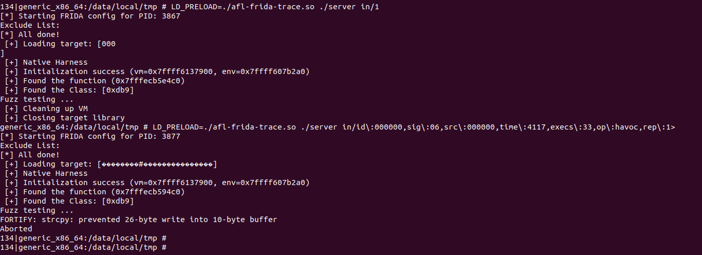
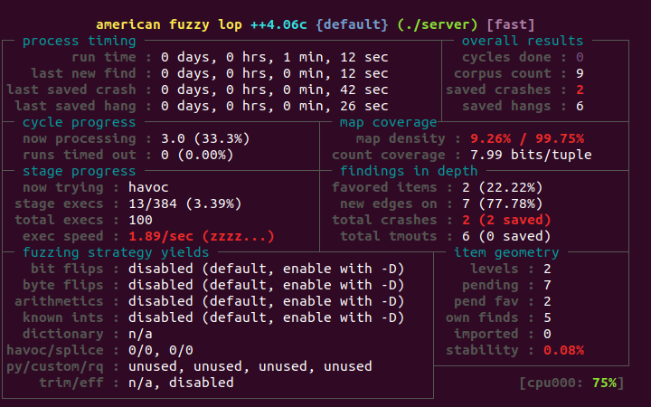
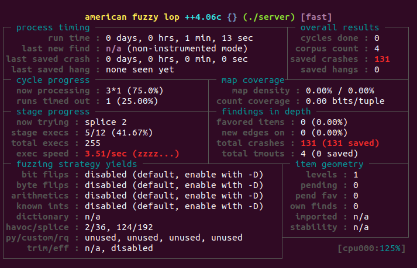

# Android Frida模式

## 1、编译命令

```bash
../android-ndk-r25c/toolchains/llvm/prebuilt/linux-x86_64/bin/x86_64-linux-android26-clang  -o server server.c ./lib/vm.c -I ./lib -L ./lib -Wall -O3 -ldl -Wl,--export-dynamic,-rpath=/data/local/tmp -w

adb push afl.js server /data/local/tmp

# 验证
adb shell
cd /data/local/tmp/
# 这种模式下，能够正常执行
LD_PRELOAD=./afl-frida-trace.so ./server in/1

# frida模式, 一定要加上AFL_NO_FORKSRV=1，不然会报错
AFL_NO_FORKSRV=1 ./afl-fuzz -i in -o out -O -- ./server @@
```

运行截图：



模糊测试运行截图：




afl.js脚本内容为：

```js
Afl.print(`[*] Starting FRIDA config for PID: ${Process.id}`);

/* Modules to be instrumented by Frida */
const MODULE_WHITELIST = [
  "/data/local/tmp/server",
  "/data/local/tmp/libtest_demo.so",
];

/* Persistent hook */
const hook_module = new CModule(`
  #include <string.h>
  #include <gum/gumdefs.h>

  void afl_persistent_hook(GumCpuContext *regs, uint8_t *input_buf,
    uint32_t input_buf_len) {

    memcpy((void *)regs->rdi, input_buf, input_buf_len);
    regs->rsi = input_buf_len;

  }
  `,
  {
    memcpy: Module.getExportByName(null, "memcpy")
  }
);

/* Persistent loop start address */
const pPersistentAddr = DebugSymbol.fromName("fuzz_one_input").address;

/* Exclude from instrumentation */
Module.load("libandroid_runtime.so");
new ModuleMap().values().forEach(m => {
  if (!MODULE_WHITELIST.includes(m.name)) {
    Afl.print(`Exclude: ${m.base}-${m.base.add(m.size)} ${m.name}`);
    Afl.addExcludedRange(m.base, m.size);
  }
});

Afl.setEntryPoint(pPersistentAddr);
Afl.setPersistentHook(hook_module.afl_persistent_hook);
Afl.setPersistentAddress(pPersistentAddr);
Afl.setPersistentCount(10000);
Afl.setInMemoryFuzzing();
Afl.setInstrumentLibraries();

Afl.done();
Afl.print("[*] All done!");
```


## 2、黑盒模糊测试

```
./afl-fuzz -i in -o out -n -- ./server @@
```

运行截图：




实际上，黑盒模糊测试执行速度要比Frida模式快1倍左右。


## 3、优化Frida模式

使用afl.js来优化Frida模式


参考文献：

https://github.com/AFLplusplus/AFLplusplus/blob/stable/frida_mode/hook/frida_hook.c

https://github.com/AFLplusplus/AFLplusplus/blob/stable/frida_mode/Scripting.md


注意：需要根据不同的cpu架构来选择持久模式

```
AFL_DEBUG=1 AFL_DEBUG_CHILD=1 AFL_FRIDA_VERBOSE=1 LD_PRELOAD=./afl-frida-trace.so ./server ./in/1
```


优化后的afl.js文件

```js
Afl.print(`[*] Starting FRIDA config for PID: ${Process.id}`);

/* Modules to be instrumented by Frida */
const MODULE_WHITELIST = [
  "/data/local/tmp/server",
  "/data/local/tmp/libtest_demo.so",
];

/* Persistent hook */
const hook_module = new CModule(`
  #include <string.h>
  #include <gum/gumdefs.h>

  #define BUF_LEN 256

  void afl_persistent_hook(GumCpuContext *regs, uint8_t *input_buf,
    uint32_t input_buf_len) {

    uint32_t length = (input_buf_len > BUF_LEN) ? BUF_LEN : input_buf_len;
    memcpy((void *)regs->rdi, input_buf, input_buf_len);
    regs->rsi = input_buf_len;

  }
  `,
  {
    memcpy: Module.getExportByName(null, "memcpy")
  }
);

/* Persistent loop start address */
const pPersistentAddr = DebugSymbol.fromName("fuzz_one_input").address;

/* Exclude from instrumentation */
Module.load("libandroid_runtime.so");
new ModuleMap().values().forEach(m => {
  if (!MODULE_WHITELIST.includes(m.name)) {
    Afl.print(`Exclude: ${m.base}-${m.base.add(m.size)} ${m.name}`);
    Afl.addExcludedRange(m.base, m.size);
  }
});

Afl.setEntryPoint(pPersistentAddr);
Afl.setPersistentHook(hook_module.afl_persistent_hook);
Afl.setPersistentAddress(pPersistentAddr);
Afl.setPersistentCount(10000);
Afl.setInMemoryFuzzing();
Afl.setInstrumentLibraries();

Afl.done();
Afl.print("[*] All done!");
```


执行

```
AFL_NO_FORKSRV=1 ./afl-fuzz -i in -o out -O -- ./server @@
```

