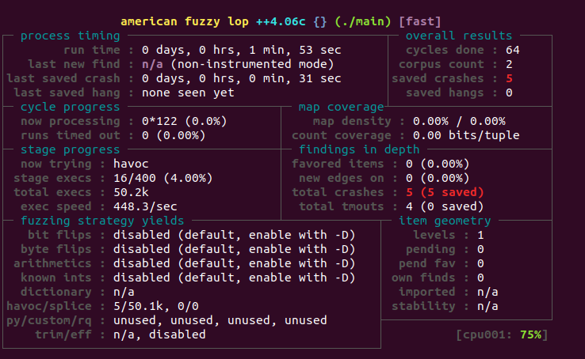

# 纯类库测试

# 一、主机测试

### 1.1 gcc编译-可执行文件

```bash
gcc -o main main.c

mkdir in
echo "000" > in/1

afl-fuzz -i in -o out -n -- ./main @@

```

运行截图：


### 1.2 gcc编译-库文件

```bash
gcc -o demo.so -shared -fPIC demo.c
g++ -o harness harness.cpp -ldl

afl-fuzz -i in -o out -n ./harness ./demo.so @@
```

运行截图：


### 1.3 frida模式-可执行文件

```bash
gcc -o main main.c

mkdir in
echo "000" > in/1

# frida模式构建
cd frida_mode/
make clean
make


afl-fuzz -i in -o out -O -- ./main @@

```

运行截图：


### 1.4 frida模式-库文件

```bash
gcc -o demo.so -shared -fPIC demo.c
g++ -o harness harness.cpp -ldl

afl-fuzz -i in -o out -O ./harness ./demo.so @@
```

运行截图：


# 二、Android 设备

### 2.1 gcc编译-可执行文件

```bash
../android-ndk-r25c/toolchains/llvm/prebuilt/linux-x86_64/bin/x86_64-linux-android26-clang -o main main.c


adb push main /data/local/tmp

adb shell
cd /data/local/tmp

mkdir in
echo "000" > in/1

./afl-fuzz -i in -o out -n -- ./main @@
```


运行截图：




### 2.2 gcc编译-库文件

```bash
../android-ndk-r25c/toolchains/llvm/prebuilt/linux-x86_64/bin/x86_64-linux-android26-clang -o demo.so -shared -fPIC demo.c
../android-ndk-r25c/toolchains/llvm/prebuilt/linux-x86_64/bin/x86_64-linux-android26-clang -o harness harness.cpp -ldl


adb push demo.so harness /data/local/tmp

adb shell
cd /data/local/tmp

mkdir in
echo "000" > in/1

./afl-fuzz -i in -o out -n ./harness ./demo.so @@
```

运行截图：


### 2.3 frida模式-可执行文件

```bash
../android-ndk-r25c/toolchains/llvm/prebuilt/linux-x86_64/bin/x86_64-linux-android26-clang -o main main.c

# frida模式构建
cd frida_mode/
make clean
make


adb shell
cd /data/local/tmp

mkdir in
echo "000" > in/1

# 这里需要删除afl.js文件才能够执行

./afl-fuzz -i in -o out -O -- ./main @@
```

运行截图：


### 2.4 frida模式-库文件

```bash
../android-ndk-r25c/toolchains/llvm/prebuilt/linux-x86_64/bin/x86_64-linux-android26-clang -o demo.so -shared -fPIC demo.c
../android-ndk-r25c/toolchains/llvm/prebuilt/linux-x86_64/bin/x86_64-linux-android26-clang -o harness harness.cpp -ldl

# frida模式构建
cd frida_mode/
make clean
make

adb shell
cd /data/local/tmp

mkdir in
echo "000" > in/1

./afl-fuzz -i in -o out -O ./harness ./demo.so @@
```

运行截图：

可以看的出来，稳定性大大的降低。


# 三、Android so

```
../android-ndk-r25c/toolchains/llvm/prebuilt/linux-x86_64/bin/x86_64-linux-android26-clang 
```

